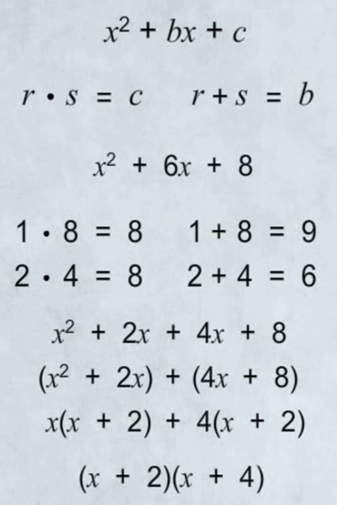

# Math Notes

<!-- TOC -->
* [Math Notes](#math-notes)
* [General Notes](#general-notes)
  * [Checking If a Number Is Divisible](#checking-if-a-number-is-divisible)
* [Fractions](#fractions)
  * [Dividing Fractions](#dividing-fractions)
* [Ratios and Rates](#ratios-and-rates)
* [Proportions](#proportions)
  * [Cross Products](#cross-products)
    * [Example 1](#example-1)
* [Variables and Real Numbers](#variables-and-real-numbers)
  * [Variables and Expressions](#variables-and-expressions)
  * [Integers](#integers)
  * [Rational and Real Numbers](#rational-and-real-numbers)
    * [Adding Real Numbers](#adding-real-numbers)
      * [Same sign](#same-sign)
      * [Different signs](#different-signs)
    * [Subtracting Real Numbers](#subtracting-real-numbers)
    * [Multiplying and Dividing Real Numbers](#multiplying-and-dividing-real-numbers)
      * [Division](#division)
      * [For multiplication:](#for-multiplication)
* [Solving Equations and Inequalities](#solving-equations-and-inequalities)
  * [Special Cases and Applications](#special-cases-and-applications)
    * [Solving Applications](#solving-applications)
    * [Special Cases](#special-cases)
      * [Example](#example)
  * [Solving One-Step Inequalities](#solving-one-step-inequalities)
    * [Recap](#recap)
  * [Solving Multi-Step Inequalities](#solving-multi-step-inequalities)
  * [Compound Inequalities](#compound-inequalities)
    * [Compound And](#compound-and)
    * [Compound Or](#compound-or)
* [Exponents and Polynomials](#exponents-and-polynomials)
  * [Exponential Notation](#exponential-notation)
    * [Negative Exponents](#negative-exponents)
  * [Simplify by Using the Product, Quotient, and Power Rules](#simplify-by-using-the-product-quotient-and-power-rules)
    * [Multiplication - The Product Rule for Exponents](#multiplication---the-product-rule-for-exponents)
    * [Division - The Quotient Rule for Exponents](#division---the-quotient-rule-for-exponents)
    * [The Power Rule For Exponents](#the-power-rule-for-exponents)
  * [Products and Quotients Raised to Powers](#products-and-quotients-raised-to-powers)
    * [A Product Raised to a Power](#a-product-raised-to-a-power)
    * [A Quotient Raised to a Power](#a-quotient-raised-to-a-power)
  * [Scientific Notation](#scientific-notation)
    * [Examples](#examples)
    * [Solving Without Rewriting](#solving-without-rewriting)
  * [Introduction to Single Variable Polynomials](#introduction-to-single-variable-polynomials)
  * [Adding Polynomials](#adding-polynomials)
    * [Example](#example-1)
  * [Multiplying Polynomials](#multiplying-polynomials)
  * [Multiplying Special Cases](#multiplying-special-cases)
  * [Dividing Monomials](#dividing-monomials)
  * [Operations With Polynomials](#operations-with-polynomials)
    * [Example 1](#example-1-1)
    * [Example 2](#example-2)
    * [Example 3](#example-3)
    * [Example 4](#example-4)
    * [Example 5](#example-5)
* [Factoring](#factoring)
  * [Greatest Common Factor](#greatest-common-factor)
    * [Example 1](#example-1-2)
    * [Example 2](#example-2-1)
    * [Example 3](#example-3-1)
    * [Example 4 - Grouping](#example-4---grouping)
  * [Solve Quadratic Equations by Factoring](#solve-quadratic-equations-by-factoring)
    * [Zero Product Property](#zero-product-property)
  * [Factoring Trinomials](#factoring-trinomials)
    * [Example 1](#example-1-3)
    * [Example 2](#example-2-2)
  * [Special Cases: Cubes](#special-cases-cubes)
    * [Example](#example-)
* [Measurements](#measurements)
  * [Length](#length)
    * [Converting Units](#converting-units)
  * [Weight](#weight)
  * [Capacity](#capacity)
  * [The Metric System](#the-metric-system)
* [Geometry](#geometry)
  * [Figures in 1 and 2 Dimensions](#figures-in-1-and-2-dimensions)
    * [Plane](#plane)
    * [Line](#line)
    * [Line Segment](#line-segment)
    * [Ray](#ray)
    * [Angle](#angle)
  * [Triangles](#triangles)
  * [Quadrilaterals](#quadrilaterals)
    * [Different Types of Quadrilaterals](#different-types-of-quadrilaterals)
      * [Parallelogram](#parallelogram)
  * [Perimeter and Area](#perimeter-and-area)
    * [Area](#area)
      * [Parallelogram](#parallelogram-1)
      * [Trapezoid](#trapezoid)
      * [Triangle](#triangle)
  * [Circles](#circles)
* [Graphing](#graphing)
  * [The Coordinate Plane](#the-coordinate-plane)
  * [Graphing Linear Equations](#graphing-linear-equations)
  * [Finding The Slope of a Line](#finding-the-slope-of-a-line)
  * [Writing The Equation of a Line](#writing-the-equation-of-a-line)
    * [Slope-Interecept Form](#slope-interecept-form)
      * [Scenario 1](#scenario-1)
      * [Scenario 2](#scenario-2)
  * [Parallel and Perpendicular Lines](#parallel-and-perpendicular-lines)
* [Systems of Equations and Inequalities](#systems-of-equations-and-inequalities)
  * [Graphic Systems of Linear Equations](#graphic-systems-of-linear-equations)
  * [The Substitution Method](#the-substitution-method)
    * [Possible Results](#possible-results)
      * [**One Solution**](#one-solution)
      * [No Solutions](#no-solutions)
      * [Infinite Solutions](#infinite-solutions)
  * [The Elimination Method](#the-elimination-method)
* [Rational Expressions](#rational-expressions)
  * [Introduction to Rational Expressions](#introduction-to-rational-expressions)
    * [Example 1](#example-1-4)
    * [Example 2](#example-2-3)
    * [Example 3](#example-3-2)
  * [Multiplying and Dividing Rational Expressions](#multiplying-and-dividing-rational-expressions)
    * [Multiplying](#multiplying)
    * [Division](#division-1)
  * [Adding and Subtracting Rational Expressions](#adding-and-subtracting-rational-expressions)
    * [Example 1](#example-1-5)
  * [Complex Rational Expressions](#complex-rational-expressions)
  * [Solving Rational Equations and Applications](#solving-rational-equations-and-applications)
    * [Work Problems](#work-problems)
    * [Example 1](#example-1-6)
    * [Example 2](#example-2-4)
    * [Example 3](#example-3-3)
    * [Example 4](#example-4-1)
  * [Rational Formulas and Variation](#rational-formulas-and-variation)
    * [Direct Variation](#direct-variation)
    * [Inverse Variation](#inverse-variation)
    * [Joint Variation](#joint-variation)
* [Radical Expressions and Quadratic Equations](#radical-expressions-and-quadratic-equations)
  * [Roots](#roots)
    * [Example](#example-2)
  * [Squares, Cubes, and Beyond](#squares-cubes-and-beyond)
    * [Example 1](#example-1-7)
  * [Multiplying and Dividing Radical Expressions](#multiplying-and-dividing-radical-expressions)
    * [Multiplying](#multiplying-1)
    * [Dividing](#dividing)
  * [Adding and Subtracting Radicals](#adding-and-subtracting-radicals)
    * [Example 1](#example-1-8)
  * [Multiplication of Multiple Term Radicals](#multiplication-of-multiple-term-radicals)
    * [Example 1](#example-1-9)
  * [Rationalizing Denominators](#rationalizing-denominators)
    * [Conjugates](#conjugates)
      * [Example](#example-3)
  * [Solving Radical Equations](#solving-radical-equations)
    * [Example 1](#example-1-10)
    * [Example 2](#example-2-5)
    * [Extraneous Solution Example](#extraneous-solution-example)
* [Functions](#functions)
  * [Identifying Functions](#identifying-functions)
  * [Evaluating Functions](#evaluating-functions)
<!-- TOC -->

# General Notes

## Checking If a Number Is Divisible

- **2**: Check if the last number is divisible by 2.
- **3**: Add each individual number and check if it's divisible by 3.
    - This can be repeated
- **4**: Check if the last two digits are divisible by 4.
- **5**: Check if the last number is divisible by 5.
- **7**: Take off and multiply the last number by 2. Subtract it from the
  remaining digits. If it's 0 or a number divisible by 7, it is. Repeat if the
  number is too large, until there's an easy to tell number.
    1. 203
    2. Take off 3 and multiply by 2 = 6
    3. Subtract 6 from 20 = 14
    4. 20 is not divisible by 7, so it's not divisible by 7.
- **8**: If the last three digits are divisible by 8, then it is.
    - If the first digit of the 3-digit number is even, then the entire number
      is divisible by 8 if the last two digits are divisible by 8.
    - If the first digit of the number is odd, then subtract the number 4 from
      the last two digits and check to see if this new number is divisible by 8.
      If it is, then the entire number is too.
- **If a number is divisible by the factors numbers that make it up,
  then it is also divisible by that number**
    - **6**: If it's divisible by both 2 and 3, it is.
    - **9**: If it's divisible by 3, it is. You can also add the numbers and see
      if it's divisible by 3.

# Fractions

**Reciprocal:** A number that, when multiplied by another number, equals 1.

- The reciprocal of 3/4 is 4/3

## Dividing Fractions

1. **Keep** - Keep the first fraction the same
2. **Change** - Change the division symbol to multiplication
3. **Flip** - Flip the second fraction to get the reciprocal

# Ratios and Rates

- **Ratio:** compares two quantities by division, or describes the relationship
  between two quantities
- **Rate:** A ratio that compares quantities that are measured in different
  units
- **Unit Rate:** compares a quantity to one unit of measure

# Proportions

- The units must be the same. Convert if needed.

## Cross Products

To check if a proportion is true, use cross multiplication.

- If they're equal, it's true.

### Example 1

# Variables and Real Numbers

## Variables and Expressions

- **Constant:** A number or symbol that represents a quantity that cannot change
- **Variable:** A letter or symbol used to represent a quantity that can change
- **Expression:** A mathematical phrase that contains operations, numbers,
  and/or variables.

## Integers

- **Counting/Natural Numbers:** Positive numbers only
- **Whole Numbers**: All the natural numbers + zero
- **Integers:** All negative and positive numbers
- **Absolute Value:** A nubmer's distance from zero, regardless of its sign
    - Displayed by using pipes one eacn side:
        - **|-3|** and **|3|** are both the same: **3**

## Rational and Real Numbers

- **Real Numbers:** Contain all integers (negative and positive). Consists of
  two sets:
    1. **Rational Numbers**
        - Numbers that can be written as the ratio of two integers, where the
          denominator is not zero.
            - Integers
            - Whole numbers
            - Natural numbers
            - A terminating or repeating decimal is a rational number.
    2. **Irrational Numbers**
        - Numbers that cannot be written as the ratio of two integers
        - Irrational numbers do not repeat and are non-terminating decimals.
        - Numbers that do not have a perfect square are also irrational.

### Adding Real Numbers

When adding real numbers, first change all the signs to be the same.

#### Same sign

1. Add their absolute values
2. Assign same sign to sum

#### Different signs

1. Find the difference of the absolute values
2. The sum gets the same sign as the number
   with the larger absolute value

**The identity property of 0:** Adding 0 to other numbers doesn't change their
value.

### Subtracting Real Numbers

**Additive Inverses:** Two numbers whose sum is **0**.

When subtracting a negative number, use its additive inverse instead.

### Multiplying and Dividing Real Numbers

- **Additive Identity:** 0
- **Multiplicative Identity:** 1
    - You can multiply any number by this without changing it.
- **Multiplicative Inverse (Reciprocal):** Two numbers that when multiplied
  equal the multiplicative identity.

#### Division

Keep, Change, Flip

#### For multiplication:

1. Multiply the top numbers
2. Multiply the bottom numbers
3. Simplify

# Solving Equations and Inequalities

## Special Cases and Applications

### Solving Applications

First get all the constants (The things that we know that are not going to
change), then create the variable (The thing that you're trying to find out.)

### Special Cases

The variable disappears on both sides, and you don't get a solution. Instead,
you get either a **True** or **False** statement.

- If it's **True**, then there's infinite solutions.
- If it's **False**, then there are no solutions.

1. `x + 5 = 5 + x`
2. `5 = 5`
    - This is true since 5 does equal 5.

#### Example

The perimeter of Tina’s rectangular garden is 60 feet. If the length of the
garden is twice the width, what are the dimensions of the garden?

- `2X = Y`

1. `4X + 2Y = 60`
2. `X + X + X + X + 2Y = 60`
3. `X + X + X + X + X + X = 60`
4. `6X = 60`
5. `X = 10`
6. `Y = 20`

## Solving One-Step Inequalities

**Inequality**

a mathematical statement that shows the relationship between two expressions
where one expression can be greater than or less than the other expression

- Inequalities can be solved similar to equations in that you can do the same
  thing to both sides.
- To check if an inequality is correct, substitute the solution value into the
  inequality to check if it holds up.
    - Check the endpoint of a **Greater/Less than (>/<)** by substituting the end
      point, and changing it to an **equals (=)** sign. Then check the point after
      and keep the sign the same.
- When multiplying by a negative number, remember to flip both sides.

### Recap

* When you multiply or divide both sides by a negative number, flip the
  inequality sign

* To check answers, check the endpoint in the related equation, and check the
  inequality by checking one or more solutions of the inequality.

## Solving Multi-Step Inequalities

1. Simplify
    - Distributive property (Eliminate parentheses)
    - Combine like-terms
2. Move variable terms to one side (usually left side)
3. Isolate variable term on one side by moving the numbers to the other side
4. Isolate variable by multiplying or dividing
    - Remember to flip the sign if multiplying or dividing by negatives.

## Compound Inequalities

two inequality statements linked together either by **"and"** or **"or"**.

You can split a compound inequality into two and solve both, or solve as is:

`7 < 3X + 4 < 10`

- **Split into two:** `7 < 3X + 4` and `3X +4 < 10`

### Compound And

- **Solution:** values that make **both** individual inequalities true
- Many **and** statements can be written as a 3-part statement:
  `X > 0 and x < 5` -> `0 < x < 5`
- Solve three-part statements by applying the properties of inequality to all
  three parts

### Compound Or

- **Solution:** values that make either of the individual inequalities true
- **Or** statements cannot be written as a single statement

# Exponents and Polynomials

## Exponential Notation

Exponential notation has a **Base** and an **Exponent**.

- The base is the number or variable, and the exponent is the exponent.

Any number _(other than zero)_ raised to the power of **0** is one.

### Negative Exponents

Any number with a negative exponent is the reciprocal of the number with a
positive exponent.

- With positive exponents, you multiply by the base.
- With negative exponents, you divide by the base (as long as it isn't zero).
    - Take the reciprocal and then attach the positive exponent to it.

## Simplify by Using the Product, Quotient, and Power Rules

### Multiplication - The Product Rule for Exponents

- When multiplying variables in exponential notation, as long as they have the
  same base, you can add the exponents.

### Division - The Quotient Rule for Exponents

- When dividing variables in exponential notation, as long as they have the
  same base, you can subtract the exponents.

### The Power Rule For Exponents

- To simplify a power of a power, you multiply the exponents, keeping the same
  base

## Products and Quotients Raised to Powers

### A Product Raised to a Power

**(ab)x = ax * bx**

- **(3x)3 = 33 * x3 = 27x3**
- When multiplying, the quotient applies to all values in the parenthesis.

### A Quotient Raised to a Power

**(x/y)3 = (x/y)
(x/y)(x/y) = x3
/y3**

- When dividing, you apply it both the numerator and the denominator

## Scientific Notation

**Scientific Notation** is a way to write very big or very small numbers so that
they're easy to read.

Scientific notation consists of two parts:

- **_a_ * 10n**
    - `a` must be greater than or equal to 1, but less than 10
      - `1 <= a < 10`
    - No fractions or decimals

**The exponent counts how many times the decimal moves left or right, not the
amount of zero's.**

- **For Positive Exponents:** If you have a number such as **5.5510**,
  then there will be `exponent - 2` zero's after it: **55,500,000,000**
- **For Negative Exponents:** If you have a number such as 
  **5.55-10**, then there will be `exponent - 1` zero's before it: 
  **.000000000555**

### Examples

  - **5.28 * 102 = 528**
  - **3 * 10-3 = .003**

### Solving Without Rewriting

1. **(4.5 x 105) * (5.28 * 10-7)**
2. **(4.5 * 5.28)(105 * 10-7)**
3. **23.76**

If the number is higher than 10, move the decimal over and increase/decrease the
exponent to account for it.

## Introduction to Single Variable Polynomials

**15x3**

- **15** is the co-efficient
- **x** is the variable
- **3** is the exponent
- The entire thing is the **term**

Different Types:

- **15x:** Monomial - One term
- **15x + 12h:** Binomial - Two terms
- **15x + 12h + 10x:** Polynomial - A monomial or sum of monomials

Polynomial terms cannot have:

- Negative exponents
- Fraction exponents
- Variables in the denominator

## Adding Polynomials

1. Combine like-terms (terms that have the same variables with the same 
  exponents)
   - Add the co-efficients and keep the variables the same

### Example

A rectangular picture frame has a length of **3a + 5** inches and a width of 
**a + 2** inches. Find the perimeter of the picture frame in inches.

1. Add the lengths and widths: 
   `(3a + 5) + (a + 2) + (3a + 5) + (a + 2)`
2. Regroup using the commutative and associative properties:
   `(3a + 3a + a + a) + (5 + 5 + 2 + 2)`
3. Combine like terms to simplify: `8a + 14`

## Multiplying Polynomials

It helps to **FOIL** when multiplying polynomials.

- **F** irst
- **O** uter
- **I** Inner
- **L** Last

**(a + b)(c + d) = ac + ad + bc + bd**

## Multiplying Special Cases

There are three special cases:

1. Square of a Sum
2. Square of a Difference
3. Product of a Sum and a Difference

1. **(a + b)2 = (a + b)(a + b) = <u>a2 + 2ab + 
   b2</u>**
2. **(a - b)2 = (a - b)(a - b) = <u>a2 - 2ab + 
   b2</u>**
3. **(a+b)(a - b) = a2 - ab + ab - b2 = 
   <u>a2 - b2</u>**
   - The final formula is using subtraction, not multiplication.

These special cases are useful, because the final answers above will always be 
a formula you can quickly apply to get the answers.

- The sign is not taken into account as part of either **a** or **b**.

## Dividing Monomials

1. Divide the coefficients
2. Divide the variables

- The monomials are rewritten from negative exponents to fractions (the 
  reciprocal)

## Operations With Polynomials

### Example 1

### Example 2

### Example 3

### Example 4

### Example 5

# Factoring

## Greatest Common Factor

1. Factor out the coefficient
2. Factor out the variables

If you cannot factor out a polynomial, use **grouping** to separate the 
polynomial into groups. Then factor out the individual groups.

- An example is below.

### Example 1

### Example 2

### Example 3

### Example 4 - Grouping

## Solve Quadratic Equations by Factoring

### Zero Product Property

If `ab = 0` then `a` or `b`, or both `= 0`.

- If one of the sides does not have a zero, just change both sides so that it 
  does.

## Factoring Trinomials

- `r` and `s` are used as examples in finding the integers to use for this setup.
  - The integers will always have a product of `c` and a sum of `b`.

### Example 1

### Example 2

In setups where you cannot factor out the coefficient, this is the difference:

- Some trinomials cannot be factored.

## Special Cases: Cubes

- **Sum of Cubes: a3 + b3 = (a + b)(a2 - ab +
  b2** 
- **Difference of Cubes: a3 - b3 = (a - b)(a2 +
  ab + b2)**

### Example 

# Measurements

## Length

In the US Customary Measurement System, the units are:

- **Mile - 5280 feet**
- **Yard - 3 feet**
- **Foot - 12 inches**
- **Inch**

### Converting Units

In order to convert units, multiply by a **conversion factor**.

- A conversion factor is the number 1 expressed as a ratio of two equivalent 
  units.

- When converting, put the new units over the old units. 
- The old units cancel out.

The three steps to multiplying and converting are:

1. Find equivalent (12 inches = 1 foot)
2. Put into ratio, new unit/old unit
3. Cancel out units and multiply

## Weight

In the US Customary Measurement System, the units are:

- Tons - 2000 pounds
- Pounds - 16 ounces
- Ounces

## Capacity

In the US Customary Measurement System, the units are:

- Gallon - 4 Quarts
- Quart - 2 Pints
- Pint - 2 Cups
- Cup - 8 Fluid Ounces
- Fluid Ounce

## The Metric System

**Metric System:** A system of measurement based on 10s used in most countries
outside the US, and in the US as well.

# Geometry

## Figures in 1 and 2 Dimensions

### Plane

- **Plane:** 2-Dimensional object that continues on forever
  - A plane is defined by 3 points.

### Line

- **Line:** 1-Dimensional object that only has length and stretches in both
  directions forever.
  - A line is defined by 2 points
  - Often written alphabetically

### Line Segment

### Ray

### Angle

- The common end point is the **vertex**.
- The angles are:
  - **Acute < 90**
  - **Right = 90**
  - **Obtuse > 90**
  - **Straight = 180**

## Triangles

You can classify triangles by both their angle and their sides.

- **Equilateral:** All sides are even length
- **Isosceles:** Two sides are even length
- **Scalene:** No sides are even length

The sum of the measure of all 3 angles of a triangle is 180 degrees.

- **Congruent Triangles:** Two triangles that have the same length sides and the
  same angles.
- **Similar Triangles:** Two triangles that have the same angles, but different
  length sides.
  - They are proportional

## Quadrilaterals

- **Polygons:** Closed plane figures with three or more straight sides
  - They are not allowed to cross over eachother
- **Triangles:** Polygons with three sides
- **Quadrilaterals:** Polygons with four sides
  - The internal angles add up to 360 degrees.
  - Any quadrilateral can be divided into two triangles

### Different Types of Quadrilaterals

#### Parallelogram

Has two pairs of parallel sides

- The opposite angles are congruent
  - The equals sign with the tilde above it is the sign for **congruent**.
- Rectangles, squares and rhombuses are parallelograms

An example of a quadrilateral that's not a parallelogram is a **Trapezoid**.

## Perimeter and Area

### Area

Area is expressed in squared units: **units2**

#### Parallelogram

With parallelograms, the area is **B * W** where *B* is base (left - right) and
*W* is width (up - down).)

#### Trapezoid

#### Triangle

## Circles

- **Radius:** Distance from the center to the circle.
- **Diameter:** A line that passes through the circle with endpoints on the 
  circle.
- **Circumference:** Distance around a circle
- **Pie:** ~= **3.14** or **22/7**

# Graphing

## The Coordinate Plane

- The **Origin** is the point where the two axes meet.
- The quadrants start with the top right one as **Quadrant 1** and count 
  counter-clockwise.
- **Ordered Pair: (x, y)**

## Graphing Linear Equations

- **Linear Equation:** An equation with two variables, and whose ordered pairs
  graph as a straight line.
- **Intercepts:** The points where the line meets the axes.

## Finding The Slope of a Line

- **Rise:** The vertical movement
- **Run:** The horizontal movement
- **Slope** is used to describe and compare steepness. It is the ratio between
  the horizontal and vertical movements.
  - **Slope/m = rise/run = y2 - 
    y1/x2 - x1**

- When calculating **Rise** and **Run**, you get the distance between two 
  integer points on the graph, where it is on an integer (not a decimal) for 
  both the **X** and **Y** axes.
- When the **Run** is left-to-right, it's positive. When it's right-to-left, 
  it's negative.

## Writing The Equation of a Line

### Slope-Interecept Form

**y = mx + b**

#### Scenario 1

If you don't know the intercept but have the slope and the coordinates for a
single pair, then:

1. Substitute the coordinate and slope into the formula
2. Solve for **b** (The Y intercept)

#### Scenario 2

If you don't know the slope or intercepts, but have two points:

1. Find the slope using the two points
2. Substitute the slope and one of the coordinates into the formula
3. Solve for **b** (The Y intercept)

## Parallel and Perpendicular Lines

- **Parallel:** Two lines have the same slope, but different intercepts
  - Never meet
- **Parallel:** Two lines have opposite reciprocal slopes
  - **y = 5/3x + 5** and **y = -3/5
    \- 2**
  - Meet at 90 degrees

# Systems of Equations and Inequalities

When a problem cannot be put into a simple equation, we put it two or more 
linear equations that share two or more unknowns.

A **System of Equations**:

- Two or more equations that share two or more unknowns
- Solution must satisfy **all** the equations in the system

## Graphic Systems of Linear Equations

One method of solving a system of linear equations is graphing. It's not always
the best method, but it is a way to tell if there even is a value that satisfies
both equations.

1. Graph out each linear equation
   - This is easiest when you solve for the intercepts for each equation, and
     then graph those.
2. Find the point where the lines intercept. This is the answer.
3. Substitute the values into the equation and check that it's true

## The Substitution Method

Substitution is another way to solve a system of linear equations, without
graphing.

1. Isolate a variable in one equation
2. Substitute that variable's expression into the other equation.
3. Solve for that variable
4. Substitute this value back in to find the remaining variable

### Possible Results

#### **One Solution**

When you get a normal result back indicating the value of the variable.

#### No Solutions

If you get a false statement such as `0 = 1`, then that means that there are 
**no solutions**.

- A parallel line

#### Infinite Solutions

If you get a True statement for all values of a variable, it means that there
are an **infinite number of solutions**, because they're the same line.

## The Elimination Method

- Also called the addition method. 

1. **Optional:** Multiply one of the equations by **-1**
2. **Optional:** Multiply or divide one side so that it has an equal amount of
   at least one variable as the other equation.
3. Add the two equations once you have opposite terms that will eliminate a
   variable.
4. Substitute that variable's value into the other equation to get the answer.

# Rational Expressions

## Introduction to Rational Expressions

A fraction that has a polynomial for either a numerator, denominator, or both is
called a **Rational Expression**.

- **Ratio**nal here refers to the fact that it's a ratio.

The first step in dealing with rational expressions is to find the **Domain**.

**Domain:** All possible values for the variables.

- This means finding and excluding the values that make the denominator equal to
  zero, since you can't divide by zero.

### Example 1

### Example 2

### Example 3

## Multiplying and Dividing Rational Expressions

### Multiplying

1. Find the domain of each denominator
2. Simplify
3. Multiply

### Division

1. Find the domain of each denominator
2. Multiply by the reciprocal of the divisor
3. Find the domain of each denominator
4. Simplify
5. Multiply

## Adding and Subtracting Rational Expressions

To find the least common denominator for denominators with no common factors,
it will be the product of the two denominators.

- **Same denominator:** add or subtract numerators and keep the denominator.
- **Different denominator:** rewrite to have a common denominator.
- Multiply one or more rational expressions by 1 in a form that gives a common
  denominator. 
- Try to find the least common denominator. 
- Always define the domain

### Example 1

## Complex Rational Expressions

1. Rewrite complex rational expressions that are stacked to be horizontal 
   rational expressions instead.
2. Find the domains
3. Perform the multiplication or division steps

## Solving Rational Equations and Applications

Rational equations are often used to solve work problems, such as how long it
will take to do something.

1. Check for excluded values in the domain. 
2. Find the common denominator (LCD is best). 
3. Multiply by 1 in a form to get common denominators then rewrite the equation 
   with just the numerators. 
   - **OR** Multiply both sides by least common denominator. 
4. Simplify and solve the remaining equation. 
5. Check answers in the original equation. 
6. Check that answers aren't excluded values.

### Work Problems

There are three formulas for calculating work problems:

- **W** = The amount of work done
- **r** = The rate of work
- **t** = Time spent working

1. **W = rt**
2. **t = W/r**
3. **r = W/t**

### Example 1

### Example 2

### Example 3

### Example 4

## Rational Formulas and Variation

Formulas that are expresses as rational equations are called **Rational 
Formulas**.

- They have input / output. The way that the output varies in relation to the
  input is called **Variation**.

### Direct Variation

**y = kx**

- `y` is the output (what you want to figure out)
- `x` is the input, a changing value
- `k` is the constant, a known input

### Inverse Variation

**y = k/x**

- It's called inverse, because the output changes inversely to the input.

### Joint Variation

**y = kxz**

- Similar to direct variation, only that it requires two inputs `(xz)` rather 
  than one.

# Radical Expressions and Quadratic Equations

## Roots

To find the square root of something, break it down into it's factors and then
simplify:

- You can also use approximations, down to the tens decimal.
- The **Radical** symbol is used to indicate square root.
- Don't use a negative sign before a radical sign.

### Example

## Squares, Cubes, and Beyond

1. Factor the term, looking for squares inside the term.
2. Rewrite with multiple variables

- **Always enclose the end result in the absolute value sign if the value is 
  even.**

**Index** is the little number above the radical, it indicates what kind of 
root you need to find.

- If there is no index, it's square root.

### Example 1

## Multiplying and Dividing Radical Expressions

### Multiplying

- `x` must be a positive integer.

### Dividing

## Adding and Subtracting Radicals

Treat them like you would variables. The variables, indexes, and variables need
to be the same.

### Example 1

## Multiplication of Multiple Term Radicals

It can be useful to treat radicals like variables. Rewrite the formula 
substituting the radicals with `x`.

1. Use the distributive property or the **FOIL** method
2. Combine like terms

### Example 1

## Rationalizing Denominators

Getting rid of the radical in a denominator is called **rationalizing the 
denominator**, and is the first step in solving an equation that has one.

### Conjugates

You can multiply a radical with more than just the radical in the denominator
by its conjugate:

#### Example

## Solving Radical Equations

Always check your answers when dealing with radicals, as there are sometimes
**extraneous solutions** that must be discarded.

- Extraneous solutions are solutions that do not work in the equation.

1. Isolate the radical expression
2. Square both sides of the equation to remove the radical
3. Solve for the unknown
4. Check all your answers

### Example 1

### Example 2

### Extraneous Solution Example

- When you get two answers, only one of them will work.

# Functions

## Identifying Functions

A function is a relation where for any input there is **only one** output.

`y = 2x`

- **x = number of bicycles = independent variable = Input**
- **y = number of wheels = dependent variable = Output**
  - It depends on the number of bicycles that come in

- If there are multiple possible `y` values, then it is **not** a function.

## Evaluating Functions

For functions, instead of putting `y = x + 1`, you'd write `f(x) = x + 1`

- Different letters instead of `f` can be used if there's multiple functions, to
  avoid confusion.
- **Given f(x) = x + 1, find (2)** just means to find the value if **x** is 2.
  - Substitute the input for **x**.
